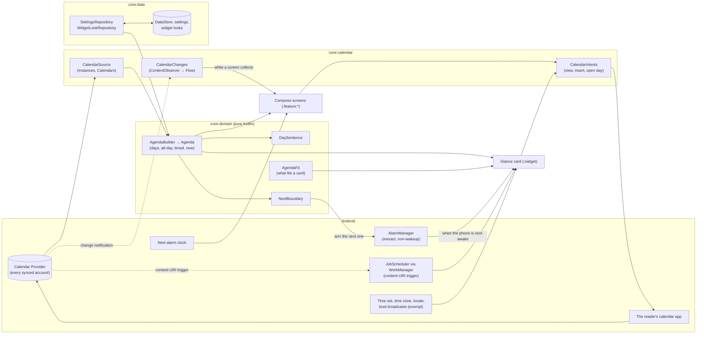

# Tempo — Technical Planning

> Companion to [VISION.md](VISION.md). This document defines the architecture, the design of the calendar engine, the widget, and the delivery phases.
> It is written to be read by humans and by Claude Code.
>
> Keep the phase checklists up to date: tick the boxes as work is merged, and record every decision and deviation with its reason in §15.

---

## 1. Tech stack

The family's stack, as Passo set it up (Passo ADR 0001), minus what Tempo has no use for.

| Concern | Choice |
|---|---|
| Language | Kotlin 2.4, compiled by AGP 9's built-in Kotlin, with the Compose compiler Gradle plugin |
| Build | Gradle 9.8 with Kotlin DSL, AGP 9.4; version catalog (`gradle/libs.versions.toml`); convention plugins in `build-logic/` |
| JDK | Java 21, `jvmTarget` 21, without a Gradle toolchain |
| SDK levels | `minSdk 34`, `targetSdk 37`, `compileSdk 37` (Passo's) |
| UI | Jetpack Compose, Material 3 in Chiaro's design language (its generated schemes, dynamic color on request), edge-to-edge |
| Widget | Jetpack Glance (`glance-appwidget` + `glance-material3`) 1.2.x, `SizeMode.Exact`, the system `TextClock` through `AndroidRemoteViews` |
| Architecture | MVVM with unidirectional data flow; coroutines and `Flow` |
| Dependency injection | Hilt |
| Calendar | The system Calendar Provider (`CalendarContract`) through the `ContentResolver`: no library |
| Persistence | DataStore (Preferences) for the settings and the widgets' looks. **No Room**: Tempo stores no event (§5) |
| Background | WorkManager (already brought by Glance, pinned as in Passo) for the calendar's content-URI trigger; `AlarmManager` inexact non-wakeup alarms for the boundaries (§7) |
| Navigation | Navigation 3, as Passo's shell |
| Time | `java.time`; Android's `DateFormat.getBestDateTimePattern` for the locale's own patterns |
| Testing | JUnit 4, Truth, Turbine, coroutines-test; Robolectric (the provider through a fake `ContentProvider`, receivers, Compose UI tests); Glance's unit test utilities |
| Quality | Android Lint (`checkDependencies`), ktlint through Spotless; Baseline Profiles later |
| CI | GitHub Actions: formatting, the forbidden-permission check on the merged manifest, unit tests and lint before the APKs. A release workflow on version tags builds the signed APK and publishes it to GitHub Releases |
| License | GPL-3.0. Every new dependency must have a GPL-3.0-compatible license (Apache-2.0, MIT, BSD) and the owner's approval |

Always pick the **latest stable** versions at setup time and record them in the version catalog. Avoid alpha versions unless a phase needs them and says why.

---

## 2. Project structure

```
tempo/
├── app/                    # Application, MainActivity, navigation, DI entry points
├── build-logic/            # Convention plugins (android-application, library, compose, feature, hilt, jvm)
├── core/
│   ├── model/              # Pure Kotlin data classes (no Android deps)
│   ├── domain/             # Pure Kotlin: the agenda, the day's sentence, the widget's fit, the next boundary
│   ├── data/               # DataStore: settings, widget looks; repositories exposing Flow
│   ├── calendar/           # The Calendar Provider's Android half: queries, change observer, intents
│   ├── designsystem/       # M3 theme, typography, shared components, icons
│   └── testing/            # test-only: the accessibility checks and the page walk the UI tests share
├── feature/
│   ├── today/              # the clock, the sentence, the agenda, the new-event button
│   ├── settings/           # settings, the calendars, about, credits
│   ├── onboarding/         # welcome, the calendar permission, the widget
│   └── guide/              # the guide, in Chiaro's shape (Phase 5)
├── widget/                 # the Glance card(s), the config screen, the refresh (job, alarm, receivers)
├── tools/                  # the launcher icon script
├── docs/                   # ADRs, screenshots
├── VISION.md
├── PLANNING.md
└── CLAUDE.md
```

Rules:

- `core:model` and `core:domain` are pure Kotlin/JVM modules. All business logic lives there and is unit-tested without Android.
- Feature modules depend on `core:*`, never on each other.
- `app` wires everything together.
- A module joins the build in the phase that brings its first code, not before (`feature:guide` in Phase 5).

---

## 3. Architecture overview



**One way in, one way out.** Events come in from the Calendar Provider only, read by `CalendarSource`. Changes go out through the calendar app only, opened by `CalendarIntents`. Tempo writes nothing but its own settings.

**The read path is computed, not stored.** A screen or a card asks for the instances of a time window and the calendars' metadata, and `:core:domain` turns them into an `Agenda`: days, each with its all-day row and its timed events, where "now" falls, what is under way, the sentence. Nothing is cached in a table; the provider answers a day's query in milliseconds.

**Live while visible.** Today collects `CalendarChanges` (a `ContentObserver` on the provider, registered only while collected) and a minute ticker, both tied to the page's lifecycle. With the page gone, nothing of Tempo runs.

**The widget is pushed, never polled** (§7): the calendar's content-URI trigger, the next boundary's inexact alarm, and the exempt time broadcasts each ask the card to recompose. Its clock is the system's `TextClock` and needs none of it.

---

## 4. The calendar engine (core design)

The riskiest part of the app: wrong days, missing occurrences and stale cards are what make readers drop agenda widgets. Build it first, with its tests, before any screen.

### 4.1 Reading the provider

- **Instances**, not Events: `CalendarContract.Instances.CONTENT_URI` with the window `[start, end)` in epoch millis appended (`Instances.CONTENT_URI.buildUpon()`, `ContentUris.appendId(begin)`, `appendId(end)`). The provider expands recurrences and applies exceptions; Tempo never parses an `RRULE`.
- **Projection** (only what is shown or decided on): `EVENT_ID`, `BEGIN`, `END`, `START_DAY`, `END_DAY`, `START_MINUTE`, `END_MINUTE`, `ALL_DAY`, `TITLE`, `EVENT_LOCATION`, `CALENDAR_ID`, `DISPLAY_COLOR` (the event's colour, or its calendar's), `STATUS`, `SELF_ATTENDEE_STATUS`, `EVENT_TIMEZONE`, `AVAILABILITY`.
- **Calendars**: `Calendars.CONTENT_URI` for `_ID`, `CALENDAR_DISPLAY_NAME`, `ACCOUNT_NAME`, `ACCOUNT_TYPE`, `CALENDAR_COLOR`, `VISIBLE`, `SYNC_EVENTS`, `IS_PRIMARY`. `VISIBLE = 0` (hidden in the calendar app) is hidden by default in Tempo too, and the reader's own choice in Tempo wins over it.
- **The window**: from the start of today to the end of the horizon's last day, in the zone of the phone, widened by a day on each side so that all-day events (stored in UTC, §4.2) are never cut off by the window itself; the domain trims.
- **Selection in the domain, not in SQL**: hidden calendars, declined invitations and cancelled events are filtered by `AgendaBuilder`, in pure Kotlin, where they are tested. The query stays the same for every reader.
- **Threading**: queries run on `Dispatchers.IO`; a `SecurityException` (the permission revoked while the app runs) becomes a state, never a crash.

### 4.2 All-day events and time zones

- An all-day event is stored from **00:00 UTC** of its first day to 00:00 UTC of the day after its last (`END` exclusive). Its days are therefore read in **UTC** (`START_DAY`/`END_DAY` are Julian days computed by the provider; or `BEGIN`/`END` converted with `ZoneOffset.UTC`), never in the phone's zone. In the phone's zone, a one-day event at UTC−5 starts at 19:00 the day before.
- A timed event is placed by its `BEGIN`/`END` in the phone's **current** zone. `EVENT_TIMEZONE` is only shown when it differs from the phone's (a flight "departs 10:00 Lisbon time"), and only if Phase 3 finds a way to say it in one line.
- A time-zone change (travel) re-reads everything: the days move, the provider's own instances table is rebuilt by the provider itself.

### 4.3 Days, overlaps, multi-day events

- A timed event that crosses midnight belongs to every day it touches; on the second day it reads "until 01:30", on the first "from 23:00".
- A multi-day all-day event is in each day's all-day row with "day 2 of 5".
- Overlapping events are listed by start, then by end, then by title; the timeline never draws them side by side (one column, the phone's width).
- The event under way: `BEGIN <= now < END`. Past: `END <= now`. Next: the first with `BEGIN > now`.

### 4.4 What is not shown

- `STATUS = STATUS_CANCELED`: never.
- `SELF_ATTENDEE_STATUS = ATTENDEE_STATUS_DECLINED`: hidden unless the reader shows declined invitations.
- Calendars the reader hid in Tempo, or hidden in the calendar app and not shown in Tempo.
- Events with no title are shown as "(No title)", the calendar app's own convention.

### 4.5 Watching for changes

- **In the app**: `CalendarChanges` is a `callbackFlow` around a `ContentObserver` registered on `CalendarContract.CONTENT_URI` with descendants, unregistered when the collector stops. Changes are debounced (a sync writes many rows at once).
- **For the widget**: a WorkManager `OneTimeWorkRequest` with `Constraints.addContentUriTrigger(CalendarContract.CONTENT_URI, true)`, re-enqueued by itself after every run (content-URI triggers are one-shot by design). It costs nothing while nothing changes; the system batches it with other work, which is fine for a card. `PROVIDER_CHANGED` cannot be received from the manifest since Android 8 (it is not on the exemption list), which is why the trigger.

### 4.6 Edge cases (all need unit tests)

- An all-day event, one day and several days, in a phone zone west of UTC, east of UTC, and at UTC.
- A timed event crossing midnight; one crossing two midnights.
- A recurring event with an exception (one occurrence moved) and a deletion (one occurrence cancelled).
- The night daylight saving starts (the 02:00–03:00 hour does not exist) and ends (01:00–02:00 happens twice); an event in the repeated hour.
- The phone's zone changing between two reads (travel).
- A zero-length event (`BEGIN = END`): a moment, shown at its time.
- An event that started yesterday and ends tomorrow (timed): on today it is in the all-day row, "day 2 of 3"; its first date keeps it as "from 21:00", its last as "until 02:00" (decided in Phase 1, §15).
- Declined, tentative, cancelled; an event with no title; a calendar with no colour.
- Today empty, the horizon empty, every calendar hidden, no calendar at all.
- Midnight while the page is open: the day rolls over without a restart.
- The permission revoked while the app is open; granted from the system's settings while the app is in the background.

### 4.7 Handing over to the calendar app

`CalendarIntents` builds every intent, and says whether something can take it (`resolveActivity`, with `<queries>` in the manifest for Android 11+ package visibility):

| What | Intent |
|---|---|
| Open an event (one occurrence) | `ACTION_VIEW`, `ContentUris.withAppendedId(Events.CONTENT_URI, eventId)`, extras `EXTRA_EVENT_BEGIN_TIME` / `EXTRA_EVENT_END_TIME` = the instance's |
| New event | `ACTION_INSERT`, `Events.CONTENT_URI`, `EXTRA_EVENT_BEGIN_TIME` = the next half hour (or the free gap's start), `EXTRA_EVENT_END_TIME` = one hour later |
| Open the calendar at a day | `ACTION_VIEW`, `CalendarContract.CONTENT_URI/time/<millis>` |
| Edit an event | `ACTION_EDIT` on the event URI: only if Phase 1 measures it working on the owner's calendar apps (VISION, From the concept); otherwise `ACTION_VIEW` |

From the widget the same intents travel as `PendingIntent`s (immutable). A "No app can open this" state replaces a button that would do nothing.

---

## 5. Data model

Tempo has no database. The Calendar Provider is the only truth for events; Tempo keeps the reader's choices.

### `:core:model` (pure)

- `CalendarInfo(id, name, accountName, accountType, color, visibleInProvider, isPrimary)`
- `EventInstance(eventId, calendarId, title, location, begin: Instant, end: Instant, allDay, color, status, selfStatus, availability, timeZone)`: as stored; an all-day event's dates are derived in the domain (`allDayDates()`, UTC), never stored beside it
- `EventStatus`, `AttendeeStatus`, `Availability`, `CalendarPermission`
- `Agenda(now, today, days, underWay, next)`, `AgendaDay(date, allDay: List<AllDayEntry>, timed: List<TimedEntry>, free: List<FreeGap>)`, `AllDayEntry(event, dayNumber, dayCount)`, `TimedEntry(event, startsOnDate, endsOnDate, state)`, `FreeGap(start, end)`. The day's sentence is computed from an `AgendaDay` by `DaySentence` (Phase 3), not stored in it
- `UserSettings`, `WidgetLook` (below)

### DataStore (Preferences), file `settings`

| Key | Default | Meaning |
|---|---|---|
| `theme`, `palette`, `font`, `dynamic_color` | system, VIVID, GOOGLE_SANS, false | The family's appearance |
| `clock_format` | SYSTEM | `ClockFormat` |
| `date_style` | LONG | `DateStyle` |
| `horizon_days` | 7 (a week; owner, §15) | Days shown: 1, 2 or 7 |
| `calendar_choices` | empty | The calendars the reader turned on or off in Tempo (a string set, one `CalendarChoice` per line, URL-encoded fields), each kept as `id` **and** `account_type/account_name/display name`, so a restore that renews the ids can still match them (`CalendarChoices`, §15) |
| `show_declined` | false | Declined invitations |
| `show_all_day` | true | All-day events |
| `show_next_alarm` | true | The next alarm line |
| `onboarding_completed` | false | |
| `asked_calendar_permission` | false | Whether the permission was ever asked: what tells "askable" from "denied for good" (§15) |

### DataStore, file `widgets` (not backed up)

One `WidgetLook` per `appWidgetId`: show clock, clock format, show date, date style, header action, event action, card ground (light, dark, system, one of six colours), opacity, show all-day, show the days ahead. Removed in `onDeleted`.

### Backup

`data_extraction_rules.xml`: `files/datastore/settings.preferences_pb` only (Passo's ADR 0007 rule: an allowlist, decided). The widgets' file stays out: widget ids are renewed by a restore.

---

## 6. Derived views (`core:domain`)

- **`AgendaBuilder`**: instances + calendars + settings + now + zone → `Agenda`. Applies §4.2–§4.4. Pure, the most tested class of the app.
- **`DaySentence`**: the day in one sentence, from the agenda alone: the count of what is left, the next event and when, the free time before it, the end of the day ("Nothing left today; tomorrow starts at 9"). Returns a structure (kind + values), never a string: the words are resources, in both languages, with plurals (`:feature:today` and `:widget` format it).
- **`FreeTime`**: the gaps between a date's busy timed events (overlaps merged; free-availability and declined events do not take the time; all-day ones neither), and on today the time from now to the next busy one. Never the evening after the last event or the morning before the first, which are not "free time" any more than the night is (§15). Every gap feeds the sentence; a gap of an hour or more is also a row of the timeline (owner, §15).
- **`NextBoundary`**: the next moment the agenda changes by itself: the nearest `BEGIN` or `END` after now, or the next midnight, whichever is first. The widget arms its alarm on it.
- **`AgendaFit`** (pure arithmetic, as Passo's `GlanceLayout`): given a card's granted size in dp, the header's choice and the text sizes measured in the system face, how many event rows fit, which form the card takes, and what the "N more" line says. Pinned by tests at the family's reference grants (one row ≈ 85 dp tall, two ≈ 189; widths 2 cells ≈ 159 dp, 3 ≈ 250, 4 ≈ 340).
- **Calendar colours are data, not roles.** They are chosen in the calendar app with no thought for Tempo's grounds, so they mark an event (a dot, a bar at the start of its row) and never colour its text or its ground. A mark keeps a 3:1 contrast with its ground by stepping its lightness when it must, a pure function with a test.

---

## 7. Widget (Glance)

Two cards in v1, the family's pair (owner, §15): «Agenda» (`AgendaWidget`, the concept's) and «In words» (`WordsWidget`, Chiaro's «In parole», Passo's «In words»). The same size spec, the same settings screen, the same refresh. The family's card (Passo's ADR 0005, from Chiaro): its corner, insets, grounds, Chiaro's six colours, opacity, and Chiaro's ink rule.

### Configuration

- `SizeMode.Exact`: every form is read off the size the launcher really granted. Glance does the work the concept gave to `onAppWidgetOptionsChanged`, and recomposes on every resize.
- Default placement 4×2 (`targetCellWidth` 4, `targetCellHeight` 2), minimum one cell, `resizeMode="horizontal|vertical"`, **no maximum** (Passo's ADR 0005: Launcher3 turns a dp maximum into the smallest cell count across its grids). Each form has a layout for any grant (`AgendaFit`, `WordsFit`, `:core:domain`; ADR 0003).
- `updatePeriodMillis = 0`. `configure` is the per-widget settings screen, `reconfigurable|configuration_optional`.
- `widgetCategory="home_screen"` in v1; `keyguard` is a later idea.

| Form | When | Content |
|---|---|---|
| CLOCK | one cell, or a row too narrow for a list beside the clock (two cells) | The time, as large as the cell holds; the date under it where it still reads (else none) |
| LINE | one row, three cells and up | The time and the date (shortened before it is shrunk) on the leading side; the next events beside them, and "N more" |
| AGENDA | two rows and up | The header (clock and date, each optional), then the events that fit, then "N more today" |
| SIDE | two rows and up, four cells, where a header on top would leave fewer than five rows (the default 4×2) | The clock and the date (over two lines if need be) in a column on the leading side, the events beside them |

With the clock and the date both hidden, the card is its list alone, on any grant. A date's all-day events share one row ("All day · Design Week, Anna's birthday"), so two holidays never push out what happens next. A row sets its time as a range where the title keeps 120 dp, its start alone where it keeps 72, else over the title.

| «In words» form | When | Content |
|---|---|---|
| NEXT | one cell | The focus's time ("Until" over "11:00", "Next" over "15:00", "Free"), its title where the cell has room |
| LINE | one row | The time and the date as a small line; the focus's time and title on one line (under it on a narrow row) |
| STACK | two rows and up | The time and date on top; the focus large (time, then title); the day's note at the bottom |
| PANEL | two rows and up, four cells | The same, with the rest of the day as a line of times ("Then 16:30 · 18:00") in place of the note's count |

The focus is the event under way, else the next one today, else (with the days ahead) the first one after today under its day's name, else "Free" (`WordsDay`). The note says times and counts, never minutes from now (§15): "Then 2 more today.", "Free until then; one more after it.", "Nothing left today.", or a free day's all-day events.

### Rendering

- **No scrolling container**: a Glance `Column`, never `LazyColumn` (a `ListView` underneath). Glance drops the eleventh child of a container silently: events go in groups of at most five, the header and the footer counted.
- **The clock and the date are a `TextClock`** in a small XML layout, placed in the card with Glance's `AndroidRemoteViews`; `format12Hour`/`format24Hour` set per widget (`RemoteViews.setCharSequence`), and with both set to the same pattern when the reader forced one. It is drawn by the launcher, updated by the system every minute, and costs the app nothing. Its text size and ink are set like the card's other text.
- Inks resolved against the ground the card really has (`widgetInk`, Chiaro's rule, as in Passo), never left to the launcher's day/night resolution.
- An event row: the calendar's mark, the time ("10:00–11:00", or "All day"), the title on one line, ellipsised; the event under way in the strong ink with "ends 11:00"; past events are not on the card at all (the card is the rest of the day).
- Previews: a static `previewLayout`, and generated previews on Android 15+ (`providePreview`) from a sample day, once per version.

### Taps

- Header (the clock and the date): Tempo's Today (the default), the calendar app at today, or the phone's clock app (owner, §15), per widget.
- Event: the event's occurrence in the calendar app (the default, as on Today), or Tempo's Today, per widget.
- "N more today", the rest of the card: Tempo's Today.
- No permission: Tempo, where Today (or the first run) asks for it.
- A door that is not on the phone (no calendar app, no clock app) falls back to Tempo, and the settings screen does not offer it.

### Update strategy (battery-aware)

- **Calendar changed**: the content-URI-triggered work (§4.5) updates every card, then re-enqueues itself.
- **A boundary**: after every render the card arms one `AlarmManager.set(RTC, NextBoundary)` (inexact, **non-wakeup**): if the phone is asleep it is delivered when the phone next wakes, which is when someone can see the card. No `SCHEDULE_EXACT_ALARM`, no `RTC_WAKEUP`.
- **Clock, zone, language**: `TIME_SET`, `TIMEZONE_CHANGED`, `LOCALE_CHANGED`, exempt from the implicit-broadcast limits, received in the manifest.
- **Boot and update**: the system sends the card its update after a boot and after an app update; the alarm and the work are armed again from it.
- **Settings changed** in the app or the card's own screen: an immediate update.
- Nothing else. No periodic work, no polling, no foreground service.

---

## 8. Notifications and system surfaces

- **No notification channel in v1**, and so no `POST_NOTIFICATIONS` (VISION, System surfaces).
- **Launcher shortcut** (static, `shortcuts.xml`): "New event", the `ACTION_INSERT` of §4.7 (owner, §15).
- **Pin request**: onboarding and Settings offer "Add the widget to the home screen" through `AppWidgetManager.requestPinAppWidget`, where the launcher supports it.

---

## 9. Battery rules (non-negotiable)

1. No service, foreground or background. Tempo runs only when a screen of it is visible, when a card is being drawn, or when the calendar changed.
2. No wakelocks of the app's own (WorkManager holds its own while its work runs, as in Chiaro and Passo).
3. No exact alarms, no wake-up alarms, no `REQUEST_IGNORE_BATTERY_OPTIMIZATIONS`, no periodic workers.
4. Nothing runs on a timer while the screen is off. The minute ticker lives in the page's lifecycle (`repeatOnLifecycle(STARTED)`), the observer in the collector's.
5. The widget's clock is the system's `TextClock`: never a repaint per minute by the app.
6. A phase that touches the refresh ends with a check: `adb shell dumpsys alarm | grep tempo` (one non-wakeup alarm at most), `adb shell dumpsys jobscheduler | grep tempo` (one content-triggered job), `dumpsys batterystats --charged com.callbackdev.tempo`, Doze (`dumpsys deviceidle force-idle`).

---

## 10. Permissions and manifest

| Permission / element | Type | Why |
|---|---|---|
| `READ_CALENDAR` | Runtime | Read the Calendar Provider (Phase 1, declared by `:core:calendar`) |
| `<queries>` for `ACTION_VIEW`/`ACTION_INSERT` on calendar URIs | Manifest | Lets Android 11+ show Tempo the calendar app, to know whether a button can work. Not a permission |
| `RECEIVE_BOOT_COMPLETED`, `WAKE_LOCK`, `ACCESS_NETWORK_STATE`, `FOREGROUND_SERVICE` | Normal | Brought by WorkManager, which Glance runs its sessions on and the calendar trigger uses, as in Chiaro and Passo. Without `INTERNET` nothing can leave the phone. Tempo's own code uses none of them. Reviewed in Phase 4 against the merged manifest: the same set as Phase 0's, nothing added by the widgets (the boundary alarm is `AlarmManager.set(RTC)`, which needs no permission); kept as WorkManager declares them, as in the sisters |
| `<queries>` for `AlarmClock.ACTION_SHOW_ALARMS` | Manifest | Lets the widget find the phone's clock app, for a card whose time opens it (Phase 4). Not a permission; Tempo opens the app's front door and never sets an alarm |
| `android:allowBackup="true"` + `dataExtractionRules` | Manifest | The settings file only (§5) |

**Forbidden:** `INTERNET`, `ACCESS_*_LOCATION`, `REQUEST_IGNORE_BATTERY_OPTIMIZATIONS`, `SCHEDULE_EXACT_ALARM`, `USE_EXACT_ALARM`, `WRITE_CALENDAR`, `READ_CONTACTS`, `WRITE_CONTACTS`, `HIGH_SAMPLING_RATE_SENSORS`, `BODY_SENSORS*`.

`checkForbiddenPermissions` (build-logic, `ForbiddenPermissionPatterns`) checks every variant's merged manifest, is wired to `check`, and runs in CI and in the release workflow. A library that adds one is removed or patched with `tools:node="remove"`.

---

## 11. Delivery phases

Each phase ends with a merged PR, green CI and its acceptance criteria met. Phases 1 and 4 need **testing on a physical device** with real accounts: an emulator's calendar has no sync and no second calendar app.

### Phase 0 — Foundations

- [x] Create the repo; add `README.md`, `LICENSE` (GPL-3.0 full text), `.gitignore`, `.editorconfig`
- [x] `VISION.md` from the owner's concept, with its corrections and open questions
- [x] Gradle setup: version catalog, `build-logic` convention plugins (Passo's, without Room), module skeleton (§2)
- [x] Hilt, Compose, Material 3 theme in Chiaro's dress (Passo's design system, copied), and `MainActivity` edge to edge with Today's clock
- [x] `strings.xml` for `values/` (English) and `values-it/`; `locales_config.xml` for per-app language
- [x] Launcher icon drawn by `tools/draw_launcher_icon.py` (the family's ring, a clock face at the lower left)
- [x] CI: formatting, forbidden permissions, unit tests, lint, then the APKs; the tag-triggered release workflow
- [x] The shared debug keystore, committed on purpose (`keystore/README.md`)
- [ ] Generate the **release keystore** (owner): outside the repo, with an offline backup, in the four GitHub secrets (`KEYSTORE_BASE64`, `KEYSTORE_PASSWORD`, `KEY_ALIAS`, `KEY_PASSWORD`). Its fingerprint goes into `keystore/README.md` and the README's Install section.
- [x] `CLAUDE.md`
- [x] `docs/adr/0001-foundations.md`, `docs/adr/0002-design-language.md`
- [x] The owner's review of VISION.md and answers to its open questions (recorded in §15)

**Acceptance:**
- CI is green.
  - Verified locally on 7 Oct 2026 with CI's own sequence: `spotlessCheck`, `checkForbiddenPermissions`, `test`, `lintDebug`, `assembleDebug`, `assembleRelease -PsignReleaseWithDebugKey`; and on GitHub, Android CI run #1 (Phase 0) and #2 (the owner's review), both green.
- The app launches and shows the time and the date.
  - Built and tested (`TodayScreenTest`: 24-hour, 12-hour, Italian); not yet run on a device.
- Adding `INTERNET` or `WRITE_CALENDAR` to any manifest fails `checkForbiddenPermissions`.
  - Verified: both added to `:core:calendar`'s manifest made the debug and release checks fail, naming both. The merged manifest today holds only WorkManager's `ACCESS_NETWORK_STATE`, `FOREGROUND_SERVICE`, `RECEIVE_BOOT_COMPLETED`, `WAKE_LOCK` and AndroidX's own `DYNAMIC_RECEIVER_NOT_EXPORTED_PERMISSION` (§10).

### Phase 1 — The calendar engine (highest risk)

- [x] `core:model`: `CalendarInfo`, `EventInstance`, `Agenda`, `AgendaDay`, `AllDayEntry`, `TimedEntry`, `FreeGap`, and the provider's codes as enums
- [x] `core:domain`: `AgendaBuilder` test-first, every case of §4.6; `NextBoundary`; `FreeTime`; `AgendaFilter` (the reader's choices); `AgendaWindow` (the query's span); `allDayDates()`; `calendarPermission()`; `nextHalfHour()`
  - 50 JVM tests (`AgendaBuilderTest` 27, `FreeTimeTest` 7, `NextBoundaryTest` 5, the rest 11).
- [x] `core:calendar`: `CalendarSource` (Instances and Calendars queries, §4.1), `CalendarChanges` (§4.5), the permission state (`CalendarAccess`: granted, askable, denied for good, from `calendarPermission()`)
  - *Deviation:* the read returns `CalendarRead` (`Read` or `NoPermission`), so a missing or revoked permission is a value the screens draw, never an exception.
- [x] `core:calendar`: a fake `ContentProvider` for the authority `com.android.calendar` under Robolectric (`FakeCalendarProvider`), so the queries themselves are tested (the URI and its window, the projection, the cursor read by column name, missing columns, a revocation mid-read), not only the domain
  - 16 Robolectric tests. The fake refuses every write: a test would fail if Tempo ever tried one.
- [x] `CalendarIntents` (§4.7) with `<queries>` (VIEW of an event, INSERT, VIEW of a day), and `canOpen()` before a button is drawn
- [ ] The intents measured on the owner's phone with the owner's calendar app(s): VIEW of an occurrence, INSERT with a start, VIEW of a day, and whether EDIT is honoured
  - *Deviation:* moved to Phase 3, where Today's buttons send them; for an earlier answer, `docs/device-checks/calendar-intents.md` has the four `adb` commands, with no Tempo build needed.
- [x] `READ_CALENDAR` in `:core:calendar`'s manifest; a debug-only screen is **not** built: the engine is proven by tests and by Phase 3's screen
  - The merged manifest now holds `READ_CALENDAR` beside WorkManager's four and AndroidX's receiver permission; `checkForbiddenPermissions` passes.

**Acceptance:**
- [x] All engine tests pass, every §4.6 case included.
  - Every case of §4.6 has its test, except the two that are about a running app (the permission granted from the system's settings while Tempo is in the background; midnight while a page is open, beyond the agenda's own turnover): they need Phase 3's page and are in its UI tests.
- [ ] On the owner's phone, Tempo's instances for a week match the calendar app's, all-day and recurring events included (a written check in §15).
  - *Deviation:* with no screen yet, this check moves to Phase 3's acceptance, where Today shows the week.

### Phase 2 — Settings

- [x] `SettingsRepository` on DataStore (§5); the appearance applied by `MainActivity` (theme, palette, typeface, wallpaper colours), as Passo's
  - Only what differs from a default is stored; an unreadable value reads as its default; a corrupt file is replaced by an empty one. 5 tests on a real DataStore file (a restart is a second store on the same file), 2 for the encoding of the calendar choices.
- [x] Settings screen: clock, date, horizon, the calendars (grouped by account, with colours and switches), declined, all-day, next alarm, appearance (with a live preview), language (the system picker), privacy, about, credits, licence
  - The calendars: `CalendarGroups` (accounts alphabetically, the phone's own last, the primary calendar first), each with its colour as a `CalendarDot` stepped to 3:1 (`markColor`), the count shown, and, with no permission, a card that asks for it (or, refused for good, opens the app's system page). Read again on the provider's changes and on every return to the page.
  - 13 UI tests from states, `assertAccessible()` on each, the page walked at twice the text size and on an open foldable; screenshots looked at.
- [x] The guide's entry, waiting for Phase 5
  - *Deviation:* not drawn at all until the guide exists: a card to a page that does not exist would be the screen lying (CLAUDE.md, Design). It comes first in the list, as in the sisters', with Phase 5.
- *Brought forward from Phase 3:* the shell's first part, so Settings can be reached: Navigation 3 with Today and Settings (`TempoRoot`), Passo's transitions, and a gear on Today. The onboarding joins it in Phase 3.

**Acceptance:**
- [x] Every setting changes what it says, and survives a restart; hiding a calendar hides its events at once.
  - On screen now: the time and date formats (Today and the preview) and the appearance. The agenda's settings (days ahead, all-day, declined, next alarm, the calendars) change the agenda, which Today draws from Phase 3: until then they are proven by `CalendarChoicesTest` ("hiding a calendar takes its events off the agenda at once") and `AgendaBuilderTest`. Every setting surviving a restart: `SettingsRepositoryTest`.

### Phase 3 — Today and onboarding

- [x] The shell (Navigation 3, as Passo's): onboarding, Today, Settings (Today and Settings since Phase 2)
  - The onboarding stands before the pages until it is done (`settings.onboardingCompleted`), not as a page to go back to.
- [x] Today: the clock, the date, the sentence, the next alarm, the all-day row, the timeline with "now", the days ahead, the states of §VISION (no permission, nothing today, no calendars, no calendar app)
  - Domain: `DaySentence` (`TodaySentence`: under way, soon, free until, all done, free day; `Tomorrow`), `DaySummary` for the days ahead, `Timeline` (the past folded, "now", the free rows), `AlarmDay`; 19 more JVM tests (152 in the whole build, all green).
  - The words: `AgendaText` in `:core:designsystem` (resources, plurals, both languages), so the widgets of Phase 4 tell the day in the same words.
  - The page: the hero on the family's glow (the clock, the date the calendar app opens on, the alarm, the sentence), the all-day chips, the timeline (the event under way on its own ground with a progress bar and the time left; past events quieter; declined ones struck through; the calendar's colour as a bar, stepped to 3:1), tomorrow in full, the following days one line an event, and a "no calendar app" note when nothing can open an event.
- [x] Touch an event (VIEW), the new-event button (INSERT), touch the date (VIEW of today); a free row's touch is a new event at its start
- [ ] The device check of the intents, moved here from Phase 1 (`docs/device-checks/calendar-intents.md`): the owner's, on the phone
- [x] Live while visible: the minute ticker and `CalendarChanges`, both lifecycle-bound
  - `TodayViewModel`: one ticker on each minute's start and the observer, shared `WhileSubscribed` (five seconds after the page goes, nothing runs); the provider read again on a new date or zone, a new horizon, a calendar change, and every return to the page (the permission, the calendars or the calendar app may have changed meanwhile); the agenda rebuilt at every tick, so "now" moves without a read. The next alarm is read at each tick (no permission).
- [x] Onboarding: welcome, the permission (with "Not now"), the widget (pin request)
  - *Deviation:* the widget's page joins with the widgets (Phase 4): a page offering a card that does not exist yet would be the screen lying. The permission's page asks, or, refused for good, opens the app's system page; "Not now" is always a way through. *Phase 4:* the widget's page is there, third.
- [x] The launcher shortcut "New event"
  - *Deviation:* dynamic (`NewEventShortcut`), not static XML: a static shortcut names its package, and the debug build's is another. It opens Tempo, which hands the new event to the calendar app at the next half hour, so Back lands on Today.
- [x] UI tests on states, not databases (Robolectric), `assertAccessible()` and `walkPage()` at twice the text size and on an open foldable
  - Today 18, onboarding 6, Settings 13; the pages walked in light, dark, twice the text size and on an open foldable; screenshots looked at.
- [x] README screenshots: Today, onboarding (`ReadmeScreenshots`, sample data, English)
  - Four: Today mid-morning, the evening in the dark theme, Settings' calendars, the first run.

**Acceptance:**
- [ ] On the owner's phone, Tempo's week matches the calendar app's, all-day and recurring events included (moved from Phase 1; a written check in §15).
- [ ] A change made in the calendar app is on Today on return, without a gesture.
  - Built for (`CalendarChanges` while the page collects, a read at every return) and tested in its parts (`CalendarChangesTest`); the gesture-free return is the owner's to see on the phone, with the check above.
- [x] TalkBack reads each event as one sentence ("10:00 to 11:00, Dentist, Via Roma 3, in Personal").
  - `TodayScreenTest` reads that very sentence off the Dentist's row: "15:00 to 15:45, Dentist, Via Roma 3, in Personal".

### Phase 4 — The widget

- [x] `AgendaFit` (pure, §6) with tests at the reference grants; the forms of §7, for both cards
  - `:core:domain`'s `widget/`: `CardAgenda` and `fitLines` (what «Agenda» lists and what fits whole), `AgendaFit`, `WordsDay`, `WordsFit`, the type's arithmetic (`TextMetrics`); 40 JVM tests. `:widget` adds 40 Robolectric tests (the cards drawn, nothing cut, the doors, the alarm, the store, the settings screen) and the README's pictures.
- [x] The card in Glance: the `TextClock` header through `AndroidRemoteViews`, the event groups, "N more", the states
  - The clock and the date are the system's `TextClock` (six small layouts, a frozen `TextView` of each for the samples); the rows in groups of five, so no container passes Glance's ten children; the states (no permission, no calendar, every calendar hidden, unreadable) measured to fit, in words that say what a touch does.
- [x] The refresh: the content-URI work, the boundary alarm, the exempt broadcasts; the battery check of §9.6
  - `WidgetRefreshArming`: the content-triggered job (re-armed by itself, appended), one `RTC` alarm at `NextBoundary`, `WidgetSystemReceiver` (time, zone, language, package replaced), Tempo's settings and the reader leaving the app (`WidgetUpdater`); the last card removed disarms both. Pinned by `WidgetDoorsTest` (one non-wakeup alarm, replaced, cancelled).
  - [ ] The battery check of §9.6 on the owner's phone: `docs/device-checks/widget-refresh.md`.
- [x] The per-widget settings screen, with the live preview (Passo's, from Chiaro)
  - The time and the date (each shown or not, each in the card's own format or Tempo's), the touches (the time: Tempo, the calendar at today, the clock app; an event: the calendar app or Tempo), the ground and its opacity, all-day events and the days ahead. The real card at the reference grants, "as placed" first.
- [x] Previews (static and generated)
  - Static `previewLayout`s of the default 4×2 cards; generated ones on Android 15+ from `WidgetSamples` (the README's week), published once per version by the Application.
- [x] `WidgetGalleryTest` draws every form to `widget/build/screenshots`; a README screenshot of the card
  - Every size, every dress, through the day, the reader's choices, Italian, the states; `WidgetFitTest` finds nothing cut, 5% wider than measured, in English and Italian, at 1, 1.15 and 1.3 the text size. README: `widgets.png`, `widget-settings.png`.
- [x] «In words» (`WordsWidget`): its forms (§7) in the same `AgendaFit` arithmetic, its gallery, its README screenshot
- [x] *From Phase 3:* the first run's widget page (the pair, Android's pin request where the launcher takes one, the way by hand where it does not), and a widgets group in Settings
- [x] *Owner, 8 Oct 2026:* a touch on the time can open the phone's clock app (§7, Taps; §15)

**Acceptance:**
- [ ] On the owner's phone, beside Chiaro's and Passo's cards: the same card, the same colours.
  - The card, its colours and inks are Passo's, unchanged (ADR 0003); the side-by-side is the owner's to see (`docs/device-checks/widget-refresh.md`, check 1).
- [ ] A calendar change reaches the card within about a minute with the screen on; a finished event leaves it within minutes; with the screen off, `dumpsys alarm` shows no wake-up alarm of Tempo's.
  - Built for (a content trigger quiet for 3 s and at most 20 s late; an `RTC` alarm at the next boundary) and pinned by tests where a JVM can (one non-wakeup alarm at the right moment); the timing on a real phone is checks 2 to 5 of the same page.

### Phase 5 — The guide, accessibility and polish

- [ ] `feature:guide`, in Chiaro's shape: the screen, the widget, what Tempo does not do and who does
- [ ] The accessibility pass: contrast (`ContrastTest`), labels, targets, twice the text size, foldables
- [ ] The privacy statement and credits in Settings
- [ ] Baseline Profile, if start-up measures slow

### Phase 6 — Release on GitHub (v1.0.0)

- [ ] The release key in the secrets (Phase 0's open box)
- [ ] `CHANGELOG.md`'s 1.0.0 section; `tempo.versionName=1.0.0`; tag `v1.0.0`
- [ ] The README's download link and the release key's fingerprint
- [ ] The sister apps' READMEs name Tempo in "The family" (Chiaro, Passo, Saldo)

### Phase 7 — Google Play (optional, later)

- [ ] As Passo's Phase 9: the same key, the store listing, the data safety form ("no data collected, no data shared").

---

## 12. Testing strategy

- **Pure Kotlin first.** `AgendaBuilder`, `DaySentence`, `FreeTime`, `NextBoundary`, `AgendaFit` and the colour mark are tested on the JVM with fixed instants and zones, every §4.6 case named in a test.
- **The provider under Robolectric.** A fake provider registered for `com.android.calendar` returns cursors built from fixtures, so `CalendarSource` is tested with the real `ContentResolver` path.
- **Screens from states.** Compose UI tests draw a screen from a state, never from a database, with `assertAccessible()` and `walkPage()` (`:core:testing`), at twice the text size and on an open foldable; their screenshots land in each module's `build/screenshots` and are looked at.
- **The widget's forms.** Glance's test utilities for content; a gallery test that draws every form at the reference grants.
- **On a device**, for what only a device can say: real accounts and sync, the calendar apps' handling of the intents, the launcher's grants, the alarm's delivery.

---

## 13. Working with Claude Code

`CLAUDE.md` holds the operating rules (commands, modules, invariants, design, signing). The workflow, as in the family:

- Work one phase at a time, from its section in §11.
- Write the domain test first for anything that decides a day, a boundary or a fit.
- Tick the boxes as work lands; record every decision and deviation, with its reason, in §15 (and as an ADR in `docs/adr/` when it is architectural).
- Run `spotlessApply`, `test`, `:app:lintDebug` and `:app:checkForbiddenPermissions` before pushing.

---

## 14. Risks and mitigations

| Risk | Mitigation |
|---|---|
| All-day events on the wrong day | Read in UTC (§4.2); tests in zones west, east and at UTC |
| A calendar app that ignores an intent | `resolveActivity` before drawing a button; VIEW over EDIT (§4.7); measured in Phase 1 |
| A card that is stale after a change | The content-URI trigger re-enqueued after each run; on return to the app, the observer; measured in Phase 4 |
| A finished event lingering on the card | The non-wakeup alarm at the boundary; the card says times, so a minute's delay never misleads |
| Launchers that grant odd sizes | `SizeMode.Exact` and a form for every grant, no maximum (Passo's ADR 0005) |
| Glance's eleventh-child limit | Events in groups of five, a test that counts children |
| Work-profile calendars invisible | Said in the guide: install Tempo in the work profile too |
| Calendar colours unreadable on a card | Marks only, never text; lightness stepped to 3:1 (§6) |
| OEM calendar providers with gaps (no `DISPLAY_COLOR`, odd `VISIBLE`) | Defensive reading with defaults; tested with columns missing |
| WorkManager's permissions in the merged manifest | Reviewed in Phase 4; the forbidden list guards what matters |

---

## 15. Decisions log and open questions

### Decided

- **7 Oct 2026, Phase 0.** The repository is `fiorenzobrioni/tempo`; package and applicationId `com.callbackdev.tempo` (debug `.debug`), as the family. License GPL-3.0. (ADR 0001)
- **7 Oct 2026, Phase 0.** Passo's build, copied: Gradle 9.8.0, AGP 9.4.1, Kotlin 2.4.20, KSP 2.3.12, Compose BOM 2026.09.00, Hilt 2.60.1, Glance 1.2.0, WorkManager 2.10.5 (pinned), Navigation 3 1.2.0, DataStore 1.2.1; convention plugins; ktlint through Spotless; JUnit 4 + Truth + Turbine + Robolectric. (ADR 0001)
- **7 Oct 2026, Phase 0.** `minSdk 34`, Passo's (owner). 33, as Chiaro and Saldo, was proposed because Tempo needs nothing from 34 and would reach Android 13 phones too; the owner chose one platform floor for the two apps built from one build-logic. (ADR 0001)
- **7 Oct 2026, Phase 0.** **No Room.** Tempo stores no event; the provider is the truth. The `passo.android.room` convention was not carried over; it returns with the first table. (ADR 0001)
- **7 Oct 2026, Phase 0.** The forbidden list is Passo's, plus `WRITE_CALENDAR`, `READ_CONTACTS`, `WRITE_CONTACTS`: the read-only promise is checked by the build. (ADR 0001)
- **7 Oct 2026, Phase 0.** Tempo's own debug key (`tempo-debug` / `android`, committed), not a sister's. (ADR 0001)
- **7 Oct 2026, Phase 0.** The design system is Passo's (itself Chiaro's): the two generated dresses, the type, the shapes, the motion, the page gutter, the widget colours, the icons; the semantic colours reduced to `attention` until a phase needs another. (ADR 0002)
- **7 Oct 2026, Phase 0.** The launcher mark: the family's ring, an amber clock face at the lower left (140°), the quadrant none of the sisters uses. The ring shades through a day, dawn's peach to the rose of the day to dusk's deep berry (owner: more shading, and not violet, which sat too close to the indigo end of Chiaro's ring). (ADR 0002)
- **7 Oct 2026, Phase 0.** The concept's corrections (VISION, From the concept to this vision): all-day events in UTC; VIEW over EDIT; a content-URI trigger instead of `PROVIDER_CHANGED`; Glance with `SizeMode.Exact` instead of a hand-written `onAppWidgetOptionsChanged`; `TextClock` kept through `AndroidRemoteViews`; digital clock in v1; no notifications in v1.

- **7 Oct 2026, owner's review of VISION.md.** Every suggestion of the vision accepted, and its open questions answered:
  1. **Widgets**: the pair, «Agenda» and «In words», both in v1 (§7, Phase 4).
  2. **Default horizon**: a week (`horizon_days = 7`). The owner was torn between a week and today-and-tomorrow; a week holds because Today keeps today on top and whole, draws the days after tomorrow compact, and the widgets give the days ahead only the room today leaves. The setting offers 1, 2 and 7.
  3. **The next alarm** on Today: yes, on by default, with a switch.
  4. **Free time**: in the sentence, and as a timeline row for a gap of an hour or more.
  5. **minSdk 34**, Passo's (above).
  6. **Name**: "Tempo", plain; GitHub Releases is the only channel. A store subtitle is Phase 7's question, if Google Play comes.
  7. **The launcher shortcut "New event"**: in v1 (Phase 3).

- **7 Oct 2026, Phase 1.** A timed event that covers a whole date (a conference from Monday 9:00 to Wednesday 17:00) is in that date's **all-day row**, "day 2 of 3"; its first and last dates keep it with its time ("from 9:00", "until 17:00"). It is not one of the calendars' all-day events: the reader's "all-day events" switch does not hide it, and it does not take the free time of the dates it covers whole.
- **7 Oct 2026, Phase 1.** **Free time** is the time between two busy events, plus, today, from now to the next one. The evening after the last event and the morning before the first are not counted ("waking hours", in the first draft of §6, would have needed a setting nobody asked for). Free-availability and declined events, and all-day ones, do not take the time; overlapping events merge.
- **7 Oct 2026, Phase 1.** An instance whose calendar is not in the calendar list (a sync landing between the two queries) is **shown**: hiding an event is worse than showing one a moment early. A calendar whose provider does not say whether it is visible is visible.
- **7 Oct 2026, Phase 1.** The provider's codes read defensively: an unknown or missing status is "confirmed", an unknown answer "none", an unknown availability "busy"; a row with no begin, no event id or no calendar id is skipped; an end before the begin is read as a moment. A maker's sync adapter must never lose an event to a value Tempo did not expect.
- **7 Oct 2026, Phase 1.** `ACTION_EDIT` is not built: `CalendarIntents` has view, insert and open-a-day. It joins if the device check (Phase 3, or `docs/device-checks/calendar-intents.md` sooner) shows the owner's calendar apps honouring it.
- **7 Oct 2026, Phase 1.** "Denied for good" needs to know whether the permission was ever asked, which Android does not say: `calendarPermission(granted, askedBefore, showRationale)` takes it from the settings (an `asked_calendar_permission` key, Phase 2).
- **7 Oct 2026, Phase 1.** The query window is today's start minus a day to the horizon's end plus a day (`AgendaWindow`), so an all-day event, stored in UTC, is never cut by the window west or east of Greenwich; the builder trims to the dates.

- **7 Oct 2026, Phase 2.** A calendar choice finds its calendar by id within the same account first (a calendar renamed in its app keeps the reader's choice), then by account and name (a restored phone, new ids). A choice whose calendar is gone is kept, in case the account comes back. A calendar with no choice follows the calendar app's `VISIBLE` (`CalendarChoices`).
- **7 Oct 2026, Phase 2.** The calendar's colour is a dot (`CalendarDot`), stepped in lightness by `markColor` until it reads at 3:1 on its ground (WCAG's ratio for a meaningful graphic); its hue is never changed. Measured: Google's "Banana" yellow is darkened on the light card, kept on the dark one.
- **7 Oct 2026, Phase 2.** The guide's card is not drawn until the guide exists (Phase 5), and the agenda's settings are on the page before the agenda (Phase 3): on a development branch, with no release between the two phases, the second is accepted; a release never ships one without the other.
- **7 Oct 2026, Phase 2.** The permission card's button is a filled one: the tonal one wore the card's own ground (secondary container) and read as plain text in the screenshots.

- **7 Oct 2026, Phase 3.** The day's sentence names what the reader acts on next: the event under way and when it ends (of two at once, the one that ends first), the next one in minutes when it is within the hour, "free until" when it is further, and with today done, tomorrow's first event. Minutes round up, never to "in 0 minutes".
- **7 Oct 2026, Phase 3.** Free rows on today only: on tomorrow's timeline five rows of "free" read as noise (the screenshots); free time is something to act on now, and a touch on its row starts a new event there. The sentence and the summaries still count every gap.
- **7 Oct 2026, Phase 3.** Today's past events fold into one "earlier" row from two of them up, so the morning never pushes what is ahead below the fold; the row opens and folds them back.
- **7 Oct 2026, Phase 3.** The clock is the hero at 80sp, grown with the reader's text size through the density (Android 14's non-linear scaling, the same curve as the rest of the page) and capped at 104dp, so "09:41" never breaks over two lines. The times' column grows with the text size and widens for the 12-hour clock (at twice the size a fixed 56dp broke "10:00" in two).
- **7 Oct 2026, Phase 3.** The new-event button floats, as the owner's concept asked: labelled, and its icon alone once the list scrolls. `assertAccessible()` learned (`:core:testing`) that a control drawn over another takes the whole overlap and leaves the one under it its larger free side, instead of halving the overlap like two neighbours' touch areas: halving read a 48dp row under the button as 26dp.
- **7 Oct 2026, Phase 3.** A row's words are cleared from the semantics and said once, as one sentence, by its description: TalkBack never reads a title twice, and the tests look for the sentence, not the pieces.
- **7 Oct 2026, after Phase 3.** The launcher ring turns slate, a pale grey-blue to a deep slate (owner: the peach, rose and berry day did not please). Brighter blues met Chiaro's night, copper melted into the amber face, a plain graphite read as a disabled icon; slate is no sister's colour and leaves the amber face the mark's one warm note. The new-event shortcut's line and the README's badges follow it (#4A5E7A, 6.3:1 on the warm white). (ADR 0002)
- **7 Oct 2026, after Phase 3.** The welcome page shows the launcher icon itself, cropped round as a launcher shows it, in place of the clock glyph on a tinted disc (owner). The icon script writes it (`ic_app_mark.xml`, `:core:designsystem`), because a feature module cannot reach the app's adaptive icon.
- **7 Oct 2026, after Phase 3.** Signing until the release key exists (owner: a temporary key, so the app is never reinstalled): already the case, with no new key. Every APK, from CI or any machine, debug or the minified testing build, is signed with the committed `keystore/debug.keystore`, so each one updates the last in place. A second, temporary key would only add one more reinstall. The one reinstall left is the first release signed with the real key over a debug-signed testing build of the same id; the debug build (`.debug`) is the one to keep installed for testing, and it never meets the release key.
- **7 Oct 2026, after Phase 3.** A crash at launch on a Galaxy Tab S8+ (owner), not reproduced here: `AppLaunchTest` (`:app`) starts the whole app (the real Application, Hilt's graph, the activity) through the first run into Today, on a phone and on a tablet, upright and on its side, Android 14 and 15, with and without the calendar's permission, and passes; the minified release shows no R8 warning and keeps its resources and fonts. With no emulator in the sandbox, debug builds now carry a crash page (`app/src/debug`: `CrashCatcher`, a provider installed before the Application; `CrashReportActivity`, in its own process, plain views): an uncaught exception shows its stack trace with Copy and Share, so a test device reports without adb. Nothing is sent; the release build has none of it.
- **7 Oct 2026, after Phase 3.** The tablet's crash is the release build's only (owner: the debug build starts), so R8's: the Hilt view-model keys, the Navigation 3 keys' serializers, the DataStore proto and WorkManager's database all survive the shrinking on inspection, so the cause is still to be read from a trace. The crash page moves to `app/src/crashpage` and joins the debug-signed release built for testing (`-PsignReleaseWithDebugKey`, CI's "testing only" APK), never a release signed with the release key: the trace comes back obfuscated and is retraced with the run's `mapping.txt`.
- **7 Oct 2026, after Phase 3.** The tablet's trace named it: `NoSuchMethodException: WorkDatabase_Impl.<init>`, in the startup provider, before any screen. WorkManager (Glance's) builds its Room database by reflection through the no-argument constructor, and the rule that should keep it, Room 2.6.1's `-keep class * extends androidx.room.RoomDatabase`, names no constructor: R8's full mode, the default, then keeps none. Passo never met it because its own Room (2.7+) ships the rule with `<init>()`. Fixed in `widget/consumer-rules.pro`, the module that brings Glance: the same rule with the constructor, and likewise Glance's `ActionCallback` rule, the same trap for the widgets' touches (Phase 4). Checked in the dex: the constructor was missing and is there now. Any phone was affected, not only the tablet; the debug build was not, since it is not shrunk.

- **8 Oct 2026, Phase 4.** **A touch on the time can open the phone's clock app** (owner: "the tap on the time can be set to open the default clock too"). Weighed before building: it is the door every clock widget has (Android's own, the Pixel's, Samsung's), and the one a reader reaches for from a clock; it matches the vision's own split (alarms are the Clock app's job, VISION non-goals) and Tempo's way of handing every action to the app that owns it. Not noise, so built: a third choice of «Touching the time and the date», beside Tempo and the calendar at today; Tempo stays the default. The clock app is the one that answers `ACTION_SHOW_ALARMS` (the reader's default, else the phone's own), opened by its launcher entry rather than by that action, which a clock app may guard with `SET_ALARM`, a permission Tempo would gain for this alone. Found through `<queries>`, offered only when there is one, and a card whose clock app was uninstalled opens Tempo. (ADR 0003)
- **8 Oct 2026, Phase 4.** The cards say clock times and counts, never minutes from now: a card is redrawn at the agenda's boundaries, not each minute, so "Dentist in 40 minutes" would be wrong a minute later. «In words» puts the focus's time large ("15:00", "Until 11:00") and says "Free until then; one more after it."; Today keeps its minutes.
- **8 Oct 2026, Phase 4.** On a card, a date's all-day events share one row ("All day · Design Week, Anna's birthday", counted as each of them in "N more"): on a card of five rows, two holidays first pushed out the meeting under way. On Today they keep their chips.
- **8 Oct 2026, Phase 4.** The default 4×2 «Agenda» is the side form (the clock and the date in a column, five events beside them) rather than the clock over two rows: the side form is chosen wherever a header on top would leave fewer than five rows. A one-row card shortens a long date ("Wed, 7 Oct") to leave the events beside the clock their times and titles; the side column writes the reader's own date over two lines first. A date that would read under 11 sp is not drawn: the clock stands alone.
- **8 Oct 2026, Phase 4.** The date on a card is a `TextClock`, so it turns at midnight exactly whatever the alarm's delivery; it is therefore written in the locale's own case ("mercoledì 7 ottobre", as Android's lock screen writes it), where Today capitalises it. A static date would read "Mercoledì" but could be a day late on a phone asleep through midnight.
- **8 Oct 2026, Phase 4.** An event's touch opens its occurrence in the calendar app by default (Tempo's Today is the other choice): it is what a touch on an event does on Today. Two occurrences of one repeating event are two pending intents (`Intent.setIdentifier`), else the second's times would ride on the first.
- **8 Oct 2026, Phase 4.** The widgets' refresh also runs when Tempo's settings change and when the reader leaves the app (where they may have granted the permission or hidden a calendar): both are the reader's own acts, never a timer. The Application listens to the settings, which costs nothing until one changes.
- **8 Oct 2026, Phase 4.** The first run's last button is now «Next» on the calendar's page and «Done» on the widgets' page; "Not now" leads to the widgets, which are offered, never required. The feature modules reach the widgets through `HomeScreenWidgets` (`:core:data`), bound by `:widget`.

### Open

None. A question that comes up during a phase is written here, with its options, before it is built.
