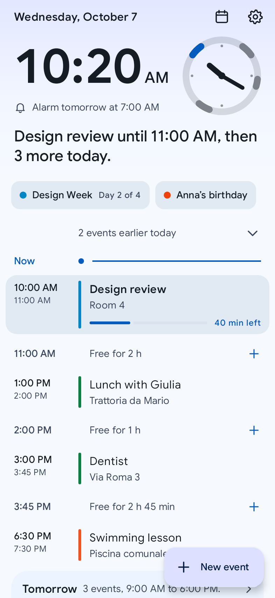
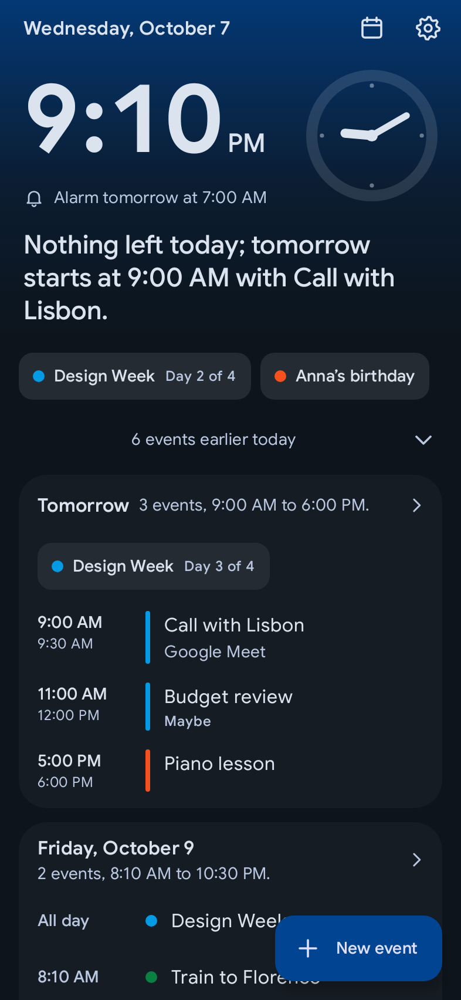
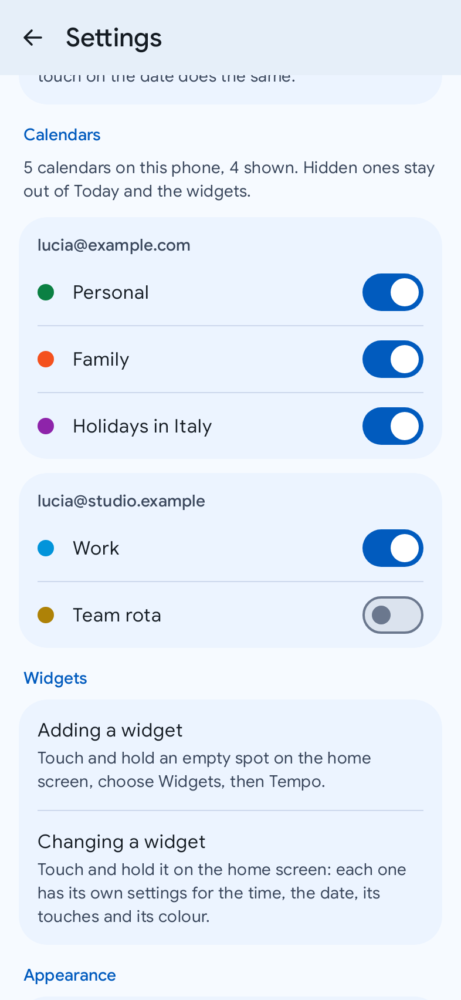
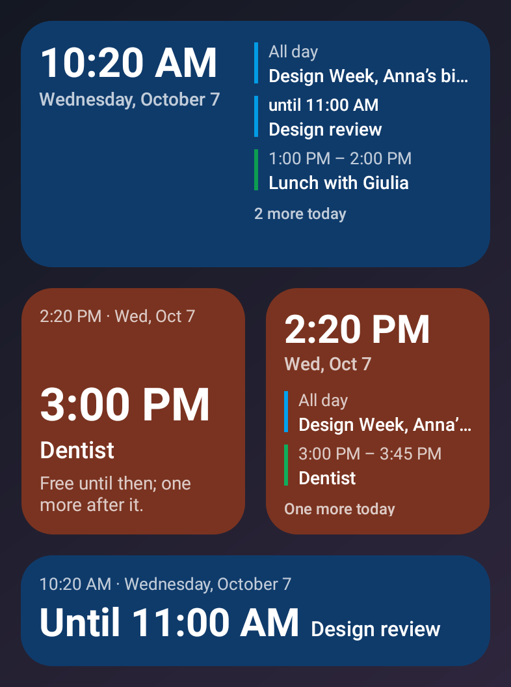
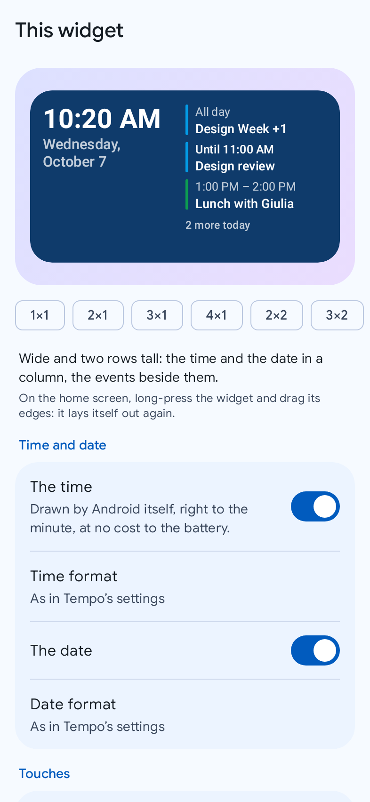
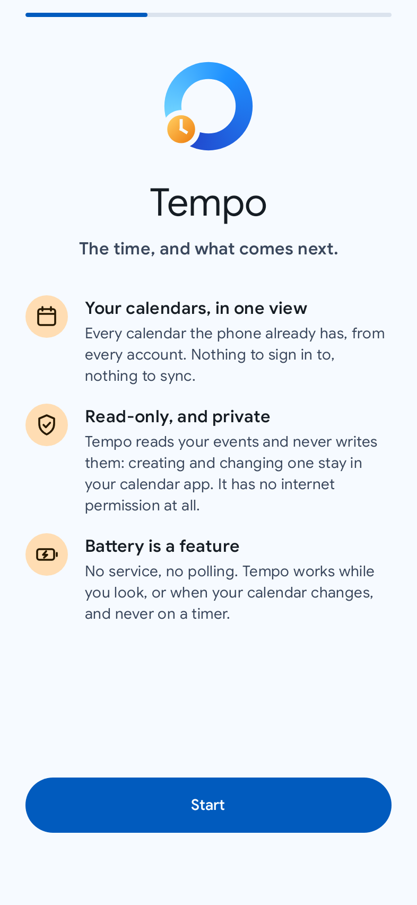
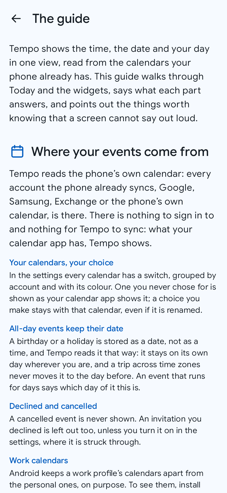

<div align="center">

# 🕓 Tempo

**The time, and what comes next. Read from your calendar, sent nowhere.**

A private, battery-friendly Android clock and agenda: the time, the date and the day's events in
one calm view, in the app and on a home-screen widget that never scrolls.
Free, no account, no ads, no tracking, and no permission to use the internet at all.


**In development.** The first release comes with Phase 6 of the [plan](./PLANNING.md).

</div>

## What Tempo is

"What time is it, and what is next?" is answered on most home screens by two widgets from two
apps that do not match: a clock that knows nothing about the day, and a calendar's agenda that
scrolls inside a page that already scrolls. Tempo joins the two. It reads the calendars the
phone already has (every account it syncs: Google, Exchange, CalDAV, a calendar kept on the
phone), shows the time and what is coming, and hands every change to the calendar app you
already use.

Tempo only reads. It cannot write your calendar, so it can never damage it.

## Screenshots

<table>
  <tr>
    <td align="center" width="33%"><br><sub><b>Today</b>: the time, the day on a dial, and one sentence</sub></td>
    <td align="center" width="33%"><br><sub><b>The evening</b>: tomorrow moves up</sub></td>
    <td align="center" width="33%"><br><sub><b>Your calendars</b>, each shown or hidden</sub></td>
  </tr>
  <tr>
    <td align="center"><br><sub><b>The widgets</b>: never a list to scroll</sub></td>
    <td align="center"><br><sub><b>Each widget</b>, set on its own</sub></td>
    <td align="center"><br><sub><b>First run</b>: one permission, to read</sub></td>
  </tr>
  <tr>
    <td align="center"><br><sub><b>The guide</b>, in the app</sub></td>
  </tr>
</table>

Drawn by the app's own screens from a realistic sample week, in English (the app also speaks
Italian). The phone's status bar is not in the pictures; the widgets are drawn by Glance as a
launcher draws them, on a stand-in wallpaper. The command that redraws them is in [Build](#build).

## Features

For 1.0 ([VISION.md](./VISION.md) has the full scope):

- 🕓 **Today**: the time large beside a clock face with the next twelve hours' events on its ring, the date, and one sentence on the day ("Dentist in 40 minutes, then 2 more today").
- 📋 **The agenda**: all-day events, the day's events on a timeline with "now" on it and the free hours between them, then the rest of the week a card a day, empty days said once.
- ⏰ **Your next alarm**, beside the clock: when you have to get up tomorrow.
- ✏️ **Your calendar app does the writing**: touch an event to open it there; the calendar button, the date and a day's name open it on that day; the new-event button opens its new-event page, the start already set.
- 🏠 **Two widgets that never scroll**: «Agenda», the clock and the date (each optional, in your format) over as many events as the card's size allows, and how many more; «In words», a clock face with the next event drawn on its ring (the hour hand walks through it by itself) and the day in a few words.
- 🪶 **A clock that costs nothing**: the widget's time is drawn by Android itself, right to the minute, with no work by the app.
- 🎛️ **Each widget its own**: the time and the date shown or not and in their own format, the background and its opacity, all-day events, the days ahead, and what a touch opens (the time: Tempo, your calendar or your clock app; an event: your calendar app or Tempo).
- ➕ **New event** from the launcher icon's long press, straight to your calendar app.
- 🗂️ **Your calendars, your choice**: every account's calendars with their colours, each shown or hidden; declined invitations kept out.
- 🎨 **Appearance**: light or dark, two palettes, three typefaces, the same as Chiaro's and Passo's.
- 📖 **The guide**: what Today and the widgets answer, who does what, and what a screen cannot say out loud.
- 🇮🇹 🇬🇧 **Italian and English**, through the system per-app language picker.

## Principles

| | |
|---|---|
| 🔒 **Private by design** | no `INTERNET` permission: Tempo cannot send anything. The build fails if a network, location, exact-alarm, calendar-writing or contacts permission appears |
| 📖 **Read-only** | one calendar permission, to read. Creating and editing stay in your calendar app |
| 📅 **One source** | the phone's own calendar storage. No account, no sync of its own, no Google services |
| 🔋 **Battery is a feature** | no service, no polling, nothing on a timer with the screen off; the widget changes only when your calendar does, or an event starts or ends |
| 🗓️ **The right day** | all-day events on their own day in every time zone; recurring events as your calendar app shows them |
| 🧾 **The screen does not lie** | a missing permission says so, a hidden calendar stays hidden, and what does not fit on the widget is counted, never cut |

## Install

Android 14 (API 34) or newer. The first release, 1.0.0, is on its way; until then there is
nothing to download.

1. Download `tempo-vX.Y.Z.apk` from the [latest release](https://github.com/fiorenzobrioni/tempo/releases/latest).
2. Open it on the phone and allow installs from that source when Android asks.
3. On the first run, allow Tempo to read your calendar (or not yet: the clock works without it).

**Verify the download.** Put the APK and its `.sha256` file in one folder and run
`sha256sum -c tempo-vX.Y.Z.apk.sha256`. To check that the APK is genuine, compare its signing
certificate (`apksigner verify --print-certs`, or AppVerifier on the phone) with this SHA-256
fingerprint:

```
A9:43:D8:BA:63:0F:C9:2A:7C:A0:89:A0:7B:71:97:15:0E:C9:9F:51:0A:2A:6D:3E:6E:21:0B:E5:65:58:58:FE
```

**Updates.** Tempo has no network access, so it cannot check for updates. Use GitHub's
"Watch, Custom, Releases" notifications, or [Obtainium](https://github.com/ImranR98/Obtainium).
Every release installs over the previous one and keeps your settings. The notes of each version
are in [CHANGELOG.md](./CHANGELOG.md).

## Roadmap

The phased plan, with every decision and its reason, is in [PLANNING.md](./PLANNING.md):

- **Phase 0**, foundations: the build, the design system, CI. *Done.*
- **Phase 1**, the calendar engine: reading the phone's calendars right, every edge case tested. *Done.*
- **Phase 2**, settings; **Phase 3**, Today and the first run. *Done.*
- **Phase 4**, the two widgets. *Done*, checked on the phone.
- **Phase 5**, the guide and the accessibility pass. *Done.*
- **Phase 6**, the 1.0 release on GitHub.

## Build

Requires JDK 21 (the one bundled with Android Studio works) and the Android SDK.

```bash
./gradlew :app:assembleDebug        # app/build/outputs/apk/debug/app-debug.apk
./gradlew test                      # unit tests, every module
./gradlew :app:lintDebug            # lint, every module
./gradlew spotlessApply             # format the code
./gradlew :app:checkForbiddenPermissions
```

For an installable minified build to test with:
`./gradlew :app:assembleRelease -PsignReleaseWithDebugKey`. It is signed with the debug key
committed in `keystore/`, on purpose, so builds from CI and any machine share one signature.
Debug builds carry `applicationIdSuffix ".debug"` and install side by side with the release.

README screenshots: `./gradlew test -PupdateScreenshots`.

CI runs formatting, the permission check, the tests and lint **before** building the APKs,
so a red suite never produces an installable artifact. A `vX.Y.Z` tag runs the same gates,
then publishes the signed APK, its checksum and the R8 mapping, with the matching
[CHANGELOG.md](./CHANGELOG.md) section as the release notes.

## Tech stack

- **Kotlin** 2.4, **Jetpack Compose** with Material 3, Gradle 9.8 and AGP 9.4, minSdk **34**
  (Android 14), target and compile SDK **37**
- The system **Calendar Provider**, read through the `ContentResolver`; no calendar library
- **DataStore** (settings), **Hilt**, **Coroutines** and **Flow**; no database: the events stay in your calendar
- **Glance** for the widgets, with Android's own `TextClock` for their clock
- **Navigation 3**, as in Passo
- Unit tests on the JVM for every edge case of the calendar engine; Compose UI tests with
  Robolectric, accessibility checks included

```text
Compose UI → ViewModel → :core:calendar (Calendar Provider, intents) → the calendar app
                      ↘ :core:domain (pure Kotlin: the agenda, the sentence, the widget's fit)
                      ↘ :core:data (DataStore settings)
```

## Project structure

```text
tempo/
├── app/                    # Application, MainActivity, navigation, DI
├── core/
│   ├── model/              # pure Kotlin data classes
│   ├── domain/             # pure Kotlin: the agenda, the day's sentence, the widget's fit
│   ├── data/               # DataStore settings, repositories
│   ├── calendar/           # the Calendar Provider, the change observer, the intents
│   ├── designsystem/       # theme, components, icons
│   └── testing/            # shared UI test helpers (accessibility, page walks)
├── feature/                # today, settings, onboarding, guide
├── widget/                 # the two Glance widgets and their settings
├── build-logic/            # convention plugins, the forbidden-permission check
├── tools/                  # the launcher icon script
└── keystore/               # the shared debug key (deliberately committed)
```

`:core:model` and `:core:domain` are pure Kotlin: a class in them that needs a `Context` is in
the wrong module.

## Project documentation

| File | Contents |
|---|---|
| [VISION.md](./VISION.md) | the product: principles, scope, non-goals, key decisions, open questions |
| [PLANNING.md](./PLANNING.md) | architecture, calendar engine, data, widget, the phased plan and its decisions |
| [docs/adr/](./docs/adr/) | the architecture decision records |
| [CHANGELOG.md](./CHANGELOG.md) | what shipped, per version; a section is written before its tag |
| [CLAUDE.md](./CLAUDE.md) | the operating rules for AI-assisted development in this repo |

## The family

Tempo is one of four focused apps with the same look and the same rules:
[Chiaro](https://github.com/fiorenzobrioni/chiaro) (weather),
[Passo](https://github.com/fiorenzobrioni/passo) (step counter) and
[Saldo](https://github.com/fiorenzobrioni/saldo) (personal finance).

## License

[GPL-3.0](./LICENSE) © 2026 Fiorenzo Brioni

[Google Sans](https://fonts.google.com/specimen/Google+Sans) and
[Inter](https://github.com/rsms/inter) under the SIL Open Font License 1.1. Full attributions
in [licenses/](./licenses/).
